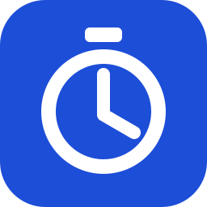

<p align="center">
  
</p>

<h1 align="center">TempoTrack</h1>

<p align="center">
  A precise, privacy-first stopwatch with reliable monotonic timing, laps, searchable local history, and portable exports.
</p>

<p align="center">
  <a href="https://buymeacoffee.com/sanskarIN">
    
  </a>
</p>

> **Made by the Sanskar**

## Highlights

- Start, pause, resume, reset, lap and split timing.
- Millisecond display precision.
- Monotonic timing: Android uses `SystemClock.elapsedRealtimeNanos()` so device sleep is included.
- Fastest, slowest and average lap statistics with recorded/fastest/slowest sorting.
- Named, searchable sessions stored locally, with rename and undo-delete flows.
- CSV and JSON export plus validated JSON history restore.
- Versioned local session, preference, and active-stopwatch storage with legacy migration.
- Persistent active-stopwatch checkpoints and Desktop mini-stopwatch visibility.
- Light, dark and system themes.
- Large-control accessibility mode and reduced-motion preference.
- Adaptive navigation for compact and large-screen layouts.
- Localization-ready shared Compose string resources.
- Android and Desktop applications with shared Kotlin/Compose UI and domain logic.
- Kotlin/Native iOS framework targets and a Compose `UIViewController` entry point for host integration.
- Desktop floating mini-stopwatch support.
- Desktop keyboard shortcuts: Space start/pause/resume, L lap, R reset, with in-app shortcut help.
- No account, ads, analytics SDK, or required network connection.

## Screenshots

Real release screenshots will replace these placeholders once the first tagged build is captured on each supported platform.

| Android | Desktop |
|---|---|
| `docs/screenshots/android-stopwatch.png` | `docs/screenshots/desktop-history.png` |

## Supported platforms

| Platform | Status |
|---|---|
| Android 8.0+ (API 26+) | Primary |
| Windows/macOS/Linux Desktop | Primary |
| iOS | Shared framework + Compose host entry point; native document/share bridge still requires the host app |

## Tech stack

- Kotlin 2.4.10
- Compose Multiplatform 1.11.0
- Android Gradle Plugin 9.3.0
- Gradle 9.5.0
- Kotlinx Coroutines 1.11.0
- Kotlinx Serialization 1.11.0

The version choices follow the current stable Kotlin/Compose/Android toolchain available when this repository was implemented.

## Quick start

Requirements:

- JDK 17 or newer
- Gradle 9.5.0 (the bootstrap scripts use a standard wrapper JAR if one is present, otherwise they delegate to an installed `gradle`)
- Android Studio with Android SDK 37 for Android builds
- A desktop OS supported by Compose Desktop
- macOS with Xcode for iOS framework compilation/tests

```bash
git clone https://github.com/sanskarIN/tempotrack.git
cd tempotrack

# Linux/macOS
./gradlew quality

# Windows
gradlew.bat quality
```

Run desktop:

```bash
./gradlew :desktopApp:run
```

Build Android debug APK:

```bash
./gradlew :androidApp:assembleDebug
```

Build the iOS Simulator framework on macOS:

```bash
./gradlew :shared:linkDebugFrameworkIosSimulatorArm64
```

See [docs/setup.md](docs/setup.md) for full setup instructions.

## Architecture

TempoTrack uses a modular-monolith structure:

- `shared/` — domain model, versioned storage contracts/codecs, serialization, shared Compose UI/resources, tests, and iOS adapters.
- `androidApp/` — Android entry point, Android monotonic clock, atomic private-file storage, and MediaStore/file export.
- `desktopApp/` — Desktop entry point, atomic JVM storage/export, keyboard shortcuts, and mini-window integration.

The stopwatch engine never derives elapsed duration from the wall clock. A `MonotonicClock` is injected so elapsed-time behavior can be tested deterministically.

See [docs/architecture.md](docs/architecture.md) and [docs/adr/0001-monotonic-time.md](docs/adr/0001-monotonic-time.md).

## Testing

```bash
./gradlew :shared:allTests
./gradlew :desktopApp:test
./gradlew :androidApp:testDebugUnitTest
./gradlew :androidApp:lintDebug
python tools/check_markdown_links.py
```

CI also performs Android/Desktop builds, iOS simulator framework verification, documentation-link checks, and security scanning. See [docs/testing.md](docs/testing.md).

## Build and release

Desktop packages:

```bash
./gradlew :desktopApp:packageDistributionForCurrentOS
```

Android release builds require production signing configuration before public distribution. Signing secrets are intentionally not committed. Tag builds derive package versions from `v*` tags, package platform artifacts, generate SHA-256 checksums, and publish GitHub Release assets after the jobs succeed.

See [docs/release.md](docs/release.md).

## Privacy and security

TempoTrack is local-first. The application includes no analytics, ads, authentication service, or app-managed cloud synchronization. Export only happens after an explicit user action. Android platform backup/device-transfer behavior is documented separately because it is controlled by the operating system.

Read [PRIVACY.md](PRIVACY.md) and [SECURITY.md](SECURITY.md).

## Contributing

Contributions are welcome. Read [CONTRIBUTING.md](CONTRIBUTING.md), run the quality suite, and keep changes focused.

## License

MIT — see [LICENSE](LICENSE).

## Contact and support

- Business: **sanskarin@outlook.in**
- Business: **sanskarin.business@gmail.com**
- Support: **supportramsandesh@gmail.com**
- GitHub: https://github.com/sanskarIN
- Buy Me a Coffee: https://buymeacoffee.com/sanskarIN

[](https://buymeacoffee.com/sanskarIN)
